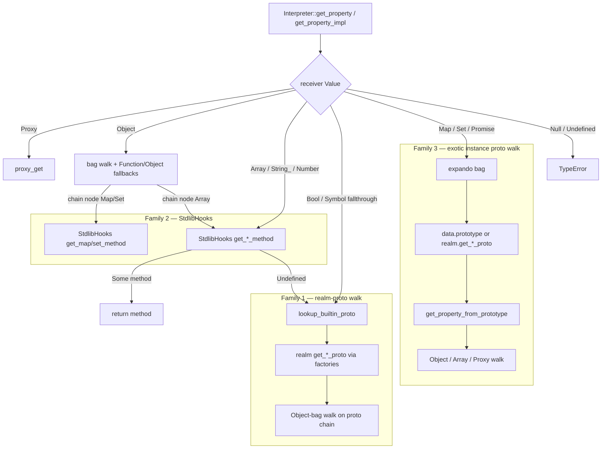

# Built-in Property Dispatch Boundaries — 2026-07-11

Decision record for issue [#506](https://github.com/dowdiness/js_engine/issues/506).
Verified against `main` @ `a2c979b` (post-#512 / #520 install contract).

This document is a **boundary map + deferral**, not an implementation plan.
It does not change `property.mbt`. Install / registration of prototypes is
[#512](https://github.com/dowdiness/js_engine/issues/512) / PR #520 territory;
this note covers **lookup and dispatch only**.

## Decision

**Option C — explicit documented split with typed boundaries.**

Full unification (Option A: extend `lookup_builtin_proto` to all receivers, or
Option B: route every built-in method get through `StdlibHooks`) is deferred.
The three dispatch styles below track real receiver shapes; collapsing them
would rewrite the hottest `[[Get]]` path without a measured win, after #512
already closed the dual-source **install** bug.

Canonical mental model going forward:

1. **Realm-proto walk** (`lookup_builtin_proto`) for primitive / Array fallthrough.
2. **Hook table** (`StdlibHooks`) only where stdlib must synthesize methods or
   break the runtime↔stdlib cycle.
3. **Ordinary proto walk** (`get_*_proto` + `get_property_from_prototype`) for
   bag-bearing exotic instances (Map / Set / Promise).

## Options considered

| Option | Idea | Why not now |
|---|---|---|
| A | Extend `lookup_builtin_proto` to all built-ins | Map/Set/Promise have instance bags and optional `[[Prototype]]` overrides; forcing them through a primitive-style helper is a high-churn hot-path rewrite |
| B | Move all built-in method lookup behind `StdlibHooks` | Unifies the circular-dep seam, but rewrites Array / Boolean / Symbol and risks diverging from installed proto bags |
| **C (chosen)** | Document typed boundaries; defer code unification | One mental model via docs + names; keeps risk off every property get |

## Status map — `get_property_impl` (string keys)

| `Value` arm | Own / special | Inherited / method path | Mechanism |
|---|---|---|---|
| `Proxy` | trap | — | Proxy |
| `Object` | bag | own walk + Function/Object fallbacks; Map/Set **as chain nodes** use hooks | Ordinary + hook-on-chain |
| `Array` | length, index, named, override | `get_array_method_with_interp` → if `Undefined` → `lookup_builtin_proto("Array")` | Hook (dead no-op) + realm-proto walk |
| `String_` | `length` | `get_string_method` → if `Undefined` → `lookup_builtin_proto("String")` | Hook (live synthesize) + realm-proto walk |
| `Number` | — | `get_number_method` → if `Undefined` → `lookup_builtin_proto("Number")` | Hook + realm-proto walk |
| `Bool` | — | `lookup_builtin_proto("Boolean")` only | Realm-proto walk |
| `Symbol` | `description`, `toString` | else `lookup_builtin_proto("Symbol")` | Own special + realm-proto walk |
| `Map` / `Set` / `Promise` | expando bag | `data.prototype` or `realm.get_*_proto()` → `get_property_from_prototype` | Ordinary proto walk |
| `Null` / `Undefined` | TypeError | — | — |

Additional hook uses outside the table:

- Map/Set **`@@iterator`** (computed / symbol get) → `get_map_method` / `get_set_method`.
- `get_promise_method` exists on `StdlibHooks` but is **not** called from
  `get_property` / `get_property_impl`; Promise string gets use proto walk only.
- Array’s `get_array_method_with_interp` always returns `Undefined` today
  (methods live on the installed `Array.prototype` bag).

## Boundary diagram

## Why the split is intentional

| Family | Receivers | Why this shape |
|---|---|---|
| 1 — `lookup_builtin_proto` | Array fallthrough, String/Number after hook miss, Boolean, Symbol | Primitives (and Array without override) have no instance `[[Prototype]]` field to walk; the realm proto cache is the synthetic start |
| 2 — `StdlibHooks` | String/Number method synthesize; Map/Set when they appear as chain nodes or for `@@iterator` | Breaks runtime↔stdlib cycles; String hooks also feed install-time population of `String.prototype` |
| 3 — `get_*_proto` + `get_property_from_prototype` | Map / Set / Promise instances | Bag-bearing exotics with optional per-instance prototype overrides; methods are installed on the proto object bag (#512 contract) |

Do not treat Family 1 and Family 3 as the same helper with different names.
Family 1 starts from a **ctor-name → realm proto** table.
Family 3 starts from the **instance’s** prototype (or realm default) and preserves
receiver for accessors / Proxy traps via `get_property_from_prototype`.

## Safety net (must stay green on any future slice)

- `interpreter/stdlib/lookup_builtin_proto_realm_wbtest.mbt` — walked dispatch for Family 1
- `interpreter/stdlib/map_set_prototype_realm_wbtest.mbt` — Map/Set realm proto identity + method isolation
- `interpreter/stdlib/borrowed_builtin_realm_wbtest.mbt` — borrowed-builtin realm routing
- Property access coverage in `interpreter/interpreter_test.mbt`

Install-contract wbtests (`builtin_install_wbtest`, `*_prototype_realm_wbtest` for
Array / Promise / boxed primitives / weak collections) pin **registration**, not
this dispatch map. Do not conflate the two.

## Non-goals for this decision

- Performance refactor of hot paths without measurement
- Mixing Map/Set file split or iterator extraction into a dispatch PR
- Big-bang rewrite of `property.mbt`
- Removing the dead Array hook in this PR (optional later hygiene, not required for C)

## Future work (only if evidence appears)

Revisit A or B only when one of these is true:

1. A concrete bug shows Family 1 and Family 3 disagree on the same realm proto
   after install pins are correct.
2. A measured hotspot attributes cost to the dual/triple path (not to call
   dispatch or bag hashing).
3. A new built-in family cannot be classified into one of the three boxes
   without inventing a fourth.

Until then, new receivers should pick the family that matches their shape and
add a realm wbtest in the matching safety-net file.
